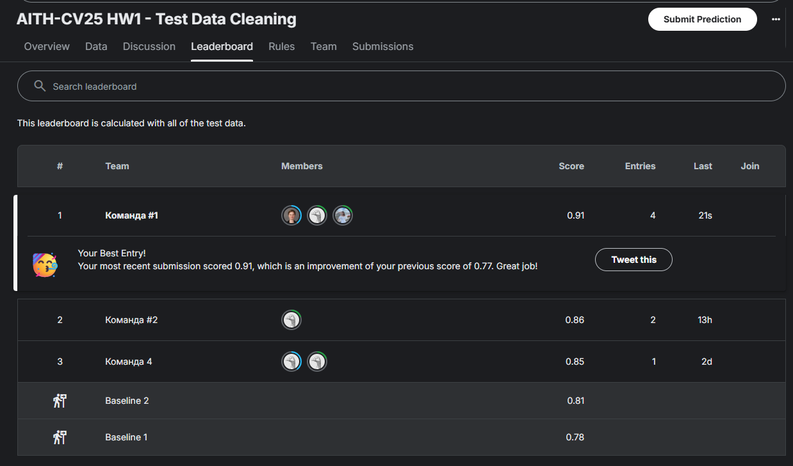

# Домашнее задание №1. Поиск дублирующихся изображений

# Отчет о проделанной работе
###### Команда #1 (Никитина Алина, Овчинникова Юлия, Горохова Александра)  

### **Описание данных**
---
### **Train**

- 456 изображений в папке `public_data/train`
- 136 изображений в папке `public_data/test`

### **Test**

- 827 изображений в папке `data/train`
- 328 изображений в папке `data/test`

---
### **Скрипты**

- `main_predict_on_public_data.py` - предсказания лишних изображений для `public_data`.
- `main_predict_on_data.py` - предсказания лишних изображений для `data`.
- `sripts` - папка со скриптами для различных методов.
- `metrics` - папка с метриками.
- `logs` - папка с логами.
- `utils` - папка с вспомогательными функциями.
- `output` - папка с результатами предсказаний.

---

### **1. Определение лишних изображений в тестовой части датасета.**

### **Цель работы**
- Определить лишние изображения в тестовой выборке, которые уже есть в тренировочной.
- Оценить точность через `F1-score`.
- Достичь метрики `F1-score > 0.81` для `public_data`.
- Оптимизировать время выполнения алгоритма до `15 минут` для `public_data`.
---

### **Методы и их анализ**
---
### 1. Хэш-методы (pHash, dHash)
Позволяют быстро сравнивать изображения с помощью хэшей. Используют для сравнения расстояние Хэмминга. Устойчивы к мелким искажениям, но чувствительны к кадрированию.

- **pHash (Perceptual Hash)** — вычисляет хэш на основе низкочастотных компонентов изображения.

Лучшая метрика F1-score — 0.7708 с порогом 15. Было применено кэширование хэшей, что позволило значительно сократить время вычислений [06:00 --> 00:14].

- **dHash (Difference Hash)** — хэш строится на разнице между соседними пикселями.

Лучшая метрика F1-score — 0.7879 с порогом 15 и кэшированием хэшей [время выполнения  00:13].

Оптимизированный вариант метода `dHash` позволил повысить метрику F1-score до 0.8037 с порогом 15 и еще чуть-чуть сократить время выполнения алгоритма [04:30 --> 00:11].

---

### 2. SSIM (Structural Similarity Index)

Метод оценивает структурное сходство изображений, хорошо работает при мелких изменениях, но медленный и не подходит для поворотов или частичных совпадений.

Лучшая метрика F1-score — 0.6337 с порогом 0.2 и размером изображения 64х64. Увеличения скорости вычислений можно добиться уменьшением размера изображения или снижением порога, но качество будет ниже.

---

### 3. Histogram (Сравнение цветовых гистограмм)

Метод анализирует распределение цвета, причем можно проверять разные цветовые пространства (HSV/RGB/YUV). Работает очень быстро, но игнорирует пространственную информацию, форму и структуру. При этом качество выше чем у хэшей.

Лучшая метрика F1-score — 0.8760 с порогом 0.85 и размером изображения 64х64. Для сравнения используется метрика корреляции в цветовом пространстве HSV.
Из методов сравнения также были испробованы интерсект и хи-квадрат; цветовые пространства RGB и YUV. Время выполнения — 00:00.

---

### 4. Методы ORB / SIFT

Методы детектируют ключевые точки и их дескрипторы.

- **ORB (Oriented FAST and Rotated BRIEF)** — устойчив к поворотам и масштабированию, хорошо справляется с аугментациями.

Показал самые высокие метрики (F1-score — 0.9273) при пороге 40 и размере изображения 128x128. Работает достаточно быстро. Время выполнения — 00:25.

- **SIFT (Scale-Invariant Feature Transform)** — метод устойчив к ракурсу и масштабу.

Очень медленный метод и показывает не слишком хорошую точность (F1-score — 0.6051). Время выполнения основной обработки — 04:41, плюс 1.5 минуты на создание дескриптеров на тренировочных данных.

---

### 5. Нейронные сети

С помощью нейросетевых методов можно извлекать признаки из изображений (эмбеддинги) и сравнивать их с помощью cosine similarity. Это позволяет находить похожие изображения даже с аугментациями. Ускорение работы можно получить с помощью GPU (работают очень быстро).

- **ResNet50**

Лучший результат F1-score — 0.8906 при пороге 0.75 и размере изображений 224x224. Время выполнения — 00:00.

- **EfficientNetB4**

Лучший результат F1-score — 0.8485 при пороге 0.75 и размере изображений 380x380. Время выполнения — 00:00.

- **ConvNeXt-Tiny**

Лучший результат F1-score — 0.8148 при пороге 0.75 и размере изображений 224x224. Время выполнения — 00:00.

---


### 6. Комбинации методов

Были испробованы разные подходы того, как можно комбинировать методы и взять лучшее от каждого. Например, сложение готовых предсказаний, отбор наиболее частых предсказаний по всем методам, а также комбинация методов ORB и ResNet50, которая и оказалась лучшей.

Часть результатов представлена ниже, остальное доступно в папке `.logs`.
```
-------------------Комбинации методов-------------------
-------------------Методы FAST_DHASH + HIST + ORB-------------------
        Presicion: 0.8056
        Recall: 0.9831
        F1-score: 0.8855
-------------------Методы HIST + ORB-------------------
        Presicion: 0.8657
        Recall: 0.9831
        F1-score: 0.9206
```

---

### **7. Итоговые результаты**

Результаты сореванования на [лидерборде Kaggle](https://www.kaggle.com/competitions/aith-cv-25-hw-1-test-data-cleaning/leaderboard).

1. **Метод ORB + ResNet50 (лидерборд 0.91)**

Основан на комбинации методов ORB и ResNet50.

Сначала делается предсказание с помощью метода ORB, затем предсказания вычитаются из тестовых данных и на оставшихся данных делается предсказание с помощью ResNet50. Далее результаты объединяются. 

Такой подход позволил получить F1-score — `0.9649` на тренировочных данных при параметрах: 40 [128x128] для ORB и 0.85 [512x512] для ResNet50. 

Время выполнения — 02:15.



2. **Метод ORB (лидерборд 0.93)**

Применение чистого метода ORB дало результат чуть выше, чем комбинация с нейросетью.

Время выполнения — 01:49.


---
Таким образом лучшим методом для выявления похожих изображений является метод 🏆 ORB 🏆.

---

### **2. Разбиение датасета на группы так, чтобы каждая группа содержала только аугментированные варианты одного и того же исходного изображения.**

### **Цель работы**
- Для всех изображений вычислить признаковое представление: хэш, дескриптор или эмбеддинг.
- Вычислить матрицу сходства / расстояний.
- Применить кластеризацию или группировку по порогу.
- Оценить долю правильно восстановленных групп.
- Достичь метрики `> 6%` полностью правильно собранных групп.
- Оптимизировать время выполнения алгоритма до `15 минут`.
---

### **Методы и их анализ**
---
### 1. ORB

Подход основан на сравнении изображений попарно с использованием дескрипторов ORB и затем кластеризации путем построения графа связей между изображениями по факту их сходства.

Результаты:
- Точное совпадение групп — 0.0058
- Время выполнения — 01:00

Вычисленное сходство с помощью ORB в данной задаче является недостаточным, поэтому в итоговой группировке оказалось много одиночных изображений, которые не были отнесены ни к одной группе. 

---

### 2. ORB + BoVW

В данном эксперименте использовалась комбинация признаков ORB и гистограм визуальных слов (BoVW) для улучшения качества кластеризации.

Также были протестированы различные методы кластеризации: KMeans и Agglomerative Clustering.

Важно отметить, что качество кластеризации сильно зависит от выбранного количества кластеров. В случае работы с тестовыми данными было задано количество кластеров, равным количеству групп в ground truth.

- **KMeans**

Алгоритм кластеризации, направленный на разбиение множества объектов на K-непересекающихся кластеров, где каждый объект относится к кластеру с ближайшим центроидом.

Результаты:
- Точное совпадение групп — 0.0385
- Время выполнения — 00:35
---
- **Agglomerative Clustering**

Иерархический алгоритм кластеризации, который последовательно объединяет наиболее похожие объекты или кластеры, формируя древовидную структуру (дендрограмму).

Результаты:
- Точное совпадение групп — 0.0769 / 0.0577 (linkage='ward' / 'average')
- Время выполнения — 00:37

---

### 3. ResNet

В этой серии экспериментов использовалась модель ResNet50 для извлечения признаков изображений.

- **K-Means**

Результаты:
- Точное совпадение групп — 0.0962
- Время выполнения — 00:07

---

- **ORB + ResNet + K-Means**

Для проверки гипотезы о том, что использование нескольких типов признаков улучшит качество кластеризации, были подмешаны признаки ORB к эмбеддингам ResNet50, далее применялась кластеризация.

Результаты:
- Точное совпадение групп — 0.00
- Время выполнения — 00:11

---

- **Agglomerative Clustering**

Результаты:
- Точное совпадение групп — 0.0962 / 0.0192 (linkage='ward' / 'average')
- Время выполнения — 00:07

---

Для итогового формирования групп изображений был выбран метод 🏆 ResNet + Agglomerative Clustering с linkage='ward' 🏆 с количеством кластеров, равным количеству групп в ground truth.

Время выполнения — 00.00