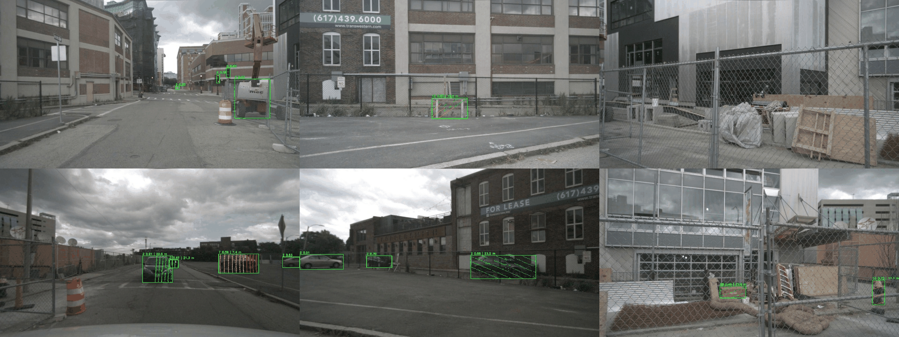

# Домашнее задание по 3D Computer Vision
# Разработка простейшей системы помощи водителю

## Установка зависимостей
Для начала создайте виртуальную среду:
```bash
python3 -m venv venv
source venv/bin/activate
```

Затем установите необходимые для работы библиотеки:
```bash
pip install -r requirements.txt
```

## Запуск
Для того, чтобы запустить обработку любой сцены на одной из камер, выполните команду:
```bash
python process_one_camera.py --scene SCENE_NUM --camera CAMERA --threshold_near THR_NEAR --threshold_mid THR_MID
```

- `--scene` - укажите номер `SCENE_NUM` интересующей Вас сцены (можно выбрать от 0 до 9, по умолчанию 0)
- `--camera` - укажите интересующую Вас камеру `CAMERA` (можно выбрать из списка: 'CAM_FRONT','CAM_FRONT_LEFT','CAM_FRONT_RIGHT','CAM_BACK''CAM_BACK_LEFT', 'CAM_BACK_RIGHT', по умолчанию 'CAM_FRONT')
- `--threshold_near` - укажите минимальное расстояние `THR_NEAR` до объекта (по умолчанию 10.0)
- `--threshold_mid` - укажите среднее расстояние `THR_MID` до объекта (по умолчанию 25.0)


Для того, чтобы запустить обработку любой сцены на всех камерах, выполните команду:
```bash
python process_all_cameras.py --scene SCENE_NUM --threshold_near THR_NEAR --threshold_mid THR_MID
```

- `--scene` - укажите номер `SCENE_NUM` интересующей Вас сцены (можно выбрать от 0 до 9, по умолчанию 0)
- `--camera` - укажите интересующую Вас камеру `CAMERA` (можно выбрать из списка: 'CAM_FRONT','CAM_FRONT_LEFT','CAM_FRONT_RIGHT','CAM_BACK''CAM_BACK_LEFT', 'CAM_BACK_RIGHT', по умолчанию 'CAM_FRONT')
- `--threshold_near` - укажите минимальное расстояние `THR_NEAR` до объекта (по умолчанию 10.0)
- `--threshold_mid` - укажите среднее расстояние `THR_MID` до объекта (по умолчанию 25.0)

## Основные этапы обработки
1. **Загрузка данных**

  На вход алгоритма подаются токены камеры (cam_token) и лидара (lidar_token), а также предобученная модель YOLO. Функции load_image и load_lidar загружают изображение и облако точек соответственно, используя API датасета NuScenes.

2. **Детекция объектов**

  Модель YOLOv8l применяется к изображению для получения 2D-боксов, классов объектов и уверенностей. Эти данные используются для дальнейшего анализа и фильтрации лидарных точек.

3. **Калибровка и проекция лидара**

  Для корректной проекции лидарных точек на изображение используются калибровочные параметры:

  - Матрица внутренних параметров камеры (cam_intrinsic).

  - Матрица преобразования из системы лидара в систему камеры (lidar2cam).

  Функция project_lidar2image проецирует 3D-точки лидара на 2D-плоскость изображения, возвращая координаты проекции (projected_uv) и соответствующие 3D-точки в системе камеры (points_3d).

4. **Фильтрация точек по 2D-боксам**

  Создается бинарная маска (create_bbox_mask), где области внутри 2D-боксов имеют значение 1. Функция filter_points_by_mask оставляет только те точки лидара, которые попадают внутрь 2D-боксов. Это позволяет связать 3D-точки с обнаруженными объектами.

5. **Расчет расстояний до объектов**

  Для каждого 2D-бокса вычисляется минимальное расстояние до соответствующих 3D-точек (compute_distances). Это расстояние используется для визуализации и анализа.

6. **Визуализация результатов**

  На изображение наносятся 2D-боксы, классы объектов, уверенность детекции и расстояния (draw_detections). Также отображаются спроецированные точки лидара, раскрашенные в зависимости от расстояния (draw_projected_points).

7. **Постобработка и сохранение результатов**

  Функции stack_camera_views и save_frames2video позволяют объединить изображения с нескольких камер в единую сетку и сохранить последовательность кадров в видеофайл.


## Результат работы

