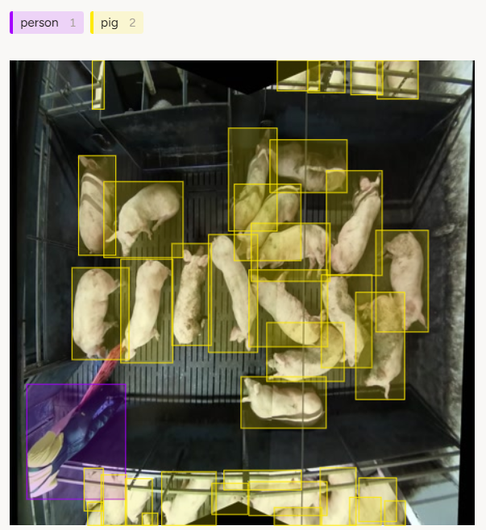

<!-- ## Домашнее задание по теме Object Detection
Написать реализацию YOLO (https://arxiv.org/abs/1506.02640) с нуля для распознавания свиней и людей.

Данные - https://disk.yandex.ru/d/qXFgvtO3y-ey_A

1. Подготовить датасет для обучения - 2 балла
2. Реализовать архитектуру YOLO и методы для её обучения - 10 баллов
3. Реализовать NMS - 2 балла
4. Реализовать метрику mAP - 2 балла
5. Подобрать оптимальные гиперпараметры - 2 балла
6. Залогировать результаты экспериментов (метрики, гиперпараметры, визуализации) - 2 балла

Для защиты домашнего задания нужно предоставить исходный код решения и отчет обо всей проделанной работе -->

# Домашнее задание №3. Object Detection

## Реализация архитектуры YOLO с нуля для распознавания свиней и людей

### Этап 1. Подготовка датасета для обучения

Исходные данные: 
- видео: верхний вид съемки в загоне для свиней
- количество видео: 10 частей
- длительность 1-й части: 1 минута
- формат видео: `.mkv`
- разрешение кадра: `1700x1700`
- частота кадров: `10.0 FPS`

Структура исходных данных:


```plaintext
scripts/
│   └── count_files.py
│   └── get_frames.py
│   └── get_unique_frames.py
│   └── replace_names_labels.py
.gitignore
README.md
```

Pipeline:

1. Разрезание видео на кадры и ресайз до 448х448
2. Извлечение уникальных кадров с помощью сравнения гистограмм --> 110 кадров
3. Ручной просмотр и удаление черных кадров --> 100 кадров
4. Разметка изображений в `Label Studio` с помощью  `bounding boxes`:
    - 2 класса: `person` и `pig`
    - хранение разметки: текстовые файлы с расширением `.txt`, где имена файлов соответствуют именам изображений (например, `1_frame_0002.jpg` → `1_frame_0002.txt`)
    - формат разметки: `<object-class> <x_center> <y_center> <width> <height>`

###


### Этап 2. Разработка архитектуры модели и обучение

*Backbone - MobileNetV2*

#### 1. Класс архитектуры YOLOv1
```
./model_scripts/YOLOv1.py
```
Состоит из:
- Backbone (можно использовать любой, в данной работе - MobileNetV2)
- FullyConnectedLayer

Возвращает для каждой ячейки вектор размерности $S × S × (C + 5B)$: 
- предсказания по классам (C - количество классов) и предсказания по bbox'ам (5 параметров: x, y, w, h, conf)

#### 2. YOLOv1 Loss

```
./metrics/YoloLoss.py
```

Вычисляет IoU (./utils/intersection_over_union.py) и выбирает наиболее подходящий target'ному объекту bbox.  

Затем считает:
- Box Loss (ошибка координат)
- Object Loss
- No Object Loss (ошибка для ячеек без объекта)
- Class Loss (ошибка классификации)

### Этап 3. Реализация NMS

```
./utils/NMS.py
```

Non-Maximum Suppression оставляет самый уверенный bbox предсказанного объекта, таким образом, вместо большого количества предсказанных bbox'ов для одного объекта остается наиболее корректный.

### Этап 4. Реализация mAP

```
./metrics/meanAP.py
```
Эта функция считает метрику Mean Average Precision (mAP). 
  
- Для каждого класса отдельно собираются предсказанные боксы и правильные боксы
- Самые уверенные предсказания проверяются первыми
- Сравниваются предсказанные боксы с реальными через IoU (Если IoU достаточно большой и объект ещё не был найден — это True Positive (TP), иначе — это False Positive (FP))
- Считаются точность (Precision) и полнота (Recall) по мере роста количества предсказаний
- Подсчёт площади под кривой Precision-Recall (Average Precision)
- Среднее по всем классам (mAP)

### Этап 5. Подбор гиперпараметров

Для поиска оптимальных гиперпараметров был использован [W&B Sweeps](https://wandb.ai/site/sweeps/)

### Этап 6. Логирование

В качестве инструмента логирования был использован W&B

## Ход работы над обучением модели

**Открытый датасет [Pig Detection](https://universe.roboflow.com/new-workspace-7kudj/pig-detection-zwty1/dataset/1)**

Так как исходный датасет был довольно небольшим, в дополнение был взят датасет открытый датасет [Pig Detection](https://universe.roboflow.com/new-workspace-7kudj/pig-detection-zwty1/dataset/1)

Данный датасет состоял из двух классов - sitpig (сидящая свинья) и standpig (стоящая свинья). На данном датасете качество реализованной модели (mAP50) получилось равным **96,4%**. [Логи эксперимента](https://api.wandb.ai/links/felisfur-wb/pi4fijch) 
  
Примеры детекции:


**Исходный датасет**

Затем оба класса (sitpig и standpig) были объединены в один класс - pig, чтобы совместить этот датасет и исходный датасет. С помощью этих данных были проведены 3 эксперимента: 
- обучение и валидация только на исходном датасете
- обучение на исходном и открытом датасете, валидация на исходном датасете
- обучение и валидация на обоих датасетах (для проверки)

|               | Only Base Data | Base + Open Train / Base Val | Base + Open Data |
| ------------- | -------------  | -------------  | -------------  |
| Val mAP       | **33%** |  **39%**    | **63%**   |
| Train maP     | **38%**   |  **72%**    | **71%**   |
| Link to logs  |  [Link](https://api.wandb.ai/links/felisfur-wb/i77sphg5)  | [Link](https://api.wandb.ai/links/felisfur-wb/029ofiy4) | [Link](https://api.wandb.ai/links/felisfur-wb/kzmgiway)|

**Открытый датасет [pigs](https://universe.roboflow.com/pigs-mpgf3/pigs-tlhe1/dataset/16)**

Также был проведен эксперимент с обучением модели на похожем на исходный датасете, включающим в себя классы pig и person. [Логи эксперимента](https://api.wandb.ai/links/felisfur-wb/5b6c7cb7)

Примеры предсказаний модели на датасете


**Открытый датасет [pigs](https://universe.roboflow.com/pigs-mpgf3/pigs-tlhe1/dataset/16) + исходный датасет**    
  
Примеры предсказаний модели на исходном датасете:


