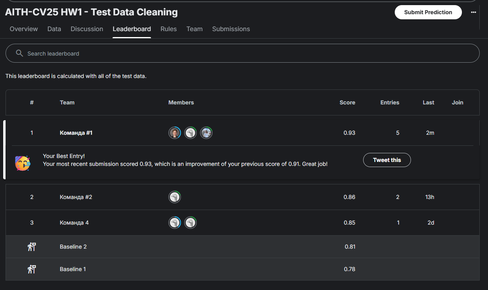

<!-- ## Домашнее задание по теме Object Detection
Написать реализацию YOLO (https://arxiv.org/abs/1506.02640) с нуля для распознавания свиней и людей.

Данные - https://disk.yandex.ru/d/qXFgvtO3y-ey_A

1. Подготовить датасет для обучения - 2 балла
2. Реализовать архитектуру YOLO и методы для её обучения - 10 баллов
3. Реализовать NMS - 2 балла
4. Реализовать метрику mAP - 2 балла
5. Подобрать оптимальные гиперпараметры - 2 балла
6. Залогировать результаты экспериментов (метрики, гиперпараметры, визуализации) - 2 балла

Для защиты домашнего задания нужно предоставить исходный код решения и отчет обо всей проделанной работе -->

# Домашнее задание №3. Object Detection

## Реализация архитектуры YOLO с нуля для распознавания свиней и людей

### Этап 1. Подготовка датасета для обучения

Исходные данные: 
- видео: верхний вид съемки в загоне для свиней
- количество видео: 10 частей
- длительность 1-й части: 1 минута
- формат видео: `.mkv`
- разрешение кадра: `1700x1700`
- частота кадров: `10.0 FPS`

Структура исходных данных:


```plaintext
scripts/
│   └── count_files.py
│   └── get_frames.py
│   └── get_unique_frames.py
│   └── replace_names_labels.py
.gitignore
README.md
```

Pipeline:

1. Разрезание видео на кадры и ресайз до 448х448
2. Извлечение уникальных кадров с помощью сравнения гистограмм --> 110 кадров
3. Ручной просмотр и удаление черных кадров --> 100 кадров
4. Разметка изображений в `Label Studio` с помощью  `bounding boxes`:
    - 2 класса: `person` и `pig`
    - хранение разметки: текстовые файлы с расширением `.txt`, где имена файлов соответствуют именам изображений (например, `1_frame_0002.jpg` → `1_frame_0002.txt`)
    - формат разметки: `<object-class> <x_center> <y_center> <width> <height>`

###


### Этап 2. Разработка архитектуры модели


### Этап 3. Реализация NMS

